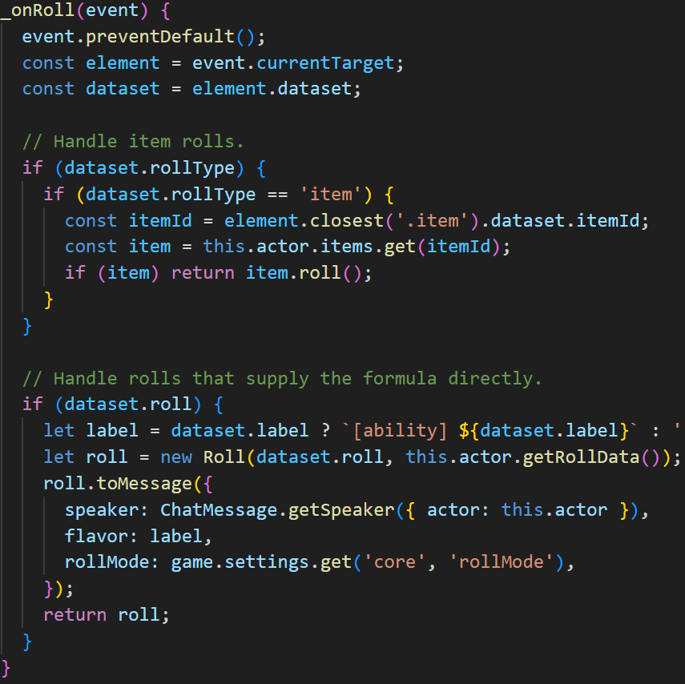

# 4. Beginning to understand
## 4.1 Third attempt and final product

After following the tutorial and figuring out the differences of v10 and the tutorial's version, I finally began to understand how to make my first sheets. I began learning Html and CSS but realized very quickly that I am in no shape or form adept in webdevelopment. I was also struggling to understand the inner concepts because of the out-of-date tutorial. So I went on search again for another source to learn from and ended up on my third and last source:

https://foundryvtt.wiki/en/development/guides/SD-tutorial/SD012-Other-options

This source recommends building the system with a boilerplate approach.
It goes similarily in depth like the 2nd tutorial but instead is much more up-to-date. This tutorial filled most of my knowledge gaps and I was finally ready to implement all the features I envisioned in the beginning of my project. This took me half a year to get to this point but from here on everything would be much easier.

## 4.2 Character/NPC-Sheets

This is the first thing I focused on because I already had input in my template.json and system.json.
Of course I didn't finish everything at once. 

Character/NPC-Sheets look very similar except NPCs have one more attribute (CR) than the characters. Therefore I will only show you the NPC Sheets (not the Character Sheet ones) and its implementation:

Above you can see the final product of the NPC-sheet with all its attributes, stats and items. 

### 4.2.1 Attributes

For each attribute, there is a column found with its numerical value that can be changed.
The "Save 5" is a button that shows the derivate value: calculated from the attributes.

Each attribute with its corresponding save-button can be pressed, and a d20 (20-sided die) will be thrown with its own flavor text, depending on what was rolled. 

The flavor text can be found in the .html in the field "data-label".

The underlined attributes in the top bar are also attributes.

### 4.2.2 Different Foundry-Items implemented

Above, you can see that the Foundry-Items Features, Description, Items, Spells and Effects are listed. Features, Items and Spells were specified in the "Goals"-section. Description is just the "Background-Story"-section that is just a plain text. Effects is something that was given in the boilerplate and has no functionality whatsoever. In further development, I might take a look on it if I ever need it for my games.

As an example: Opening any other tab overshadows the previous one and shows the underlying Foundry-Items. In the case above, the "items"-tab has been chosen, and the test item can be seen.
Similar to the attributes that can be rolled, the test item can be rolled as well in the given "Roll Formula". 

This looks as such when rolled.
Note: In the screenshot, the roll formula seems to return a 0 for @lvl (when there is supposed to be a 1). Also happening with the @str (0 instead of 5). This is due to the wrong use of the formula. This would be the correct in and output:

The implementation of this functionality completely resides in the actor-sheet.mjs: 

The underlined function in red is the first function that was necessary to make rolls be rollable.
It is one of 6 functions that are used in actor-sheets seen above:

- function for item-/:
	- edit
	- create
	- delete
- effect-control
- function for rollable
- function for li.item

The implementation of all functions can be found in the actor-sheet.mjs.

The implementation of onRoll for "rollable" listens into the click event and retrieves all attributes and stats through the actor-object. A roll is returned with the fields speaker, flavor and rollMode which are filled through the .html.

All other functions are implemented in the same way within a function, but for the sake of conciseness I won't go into more detail. 